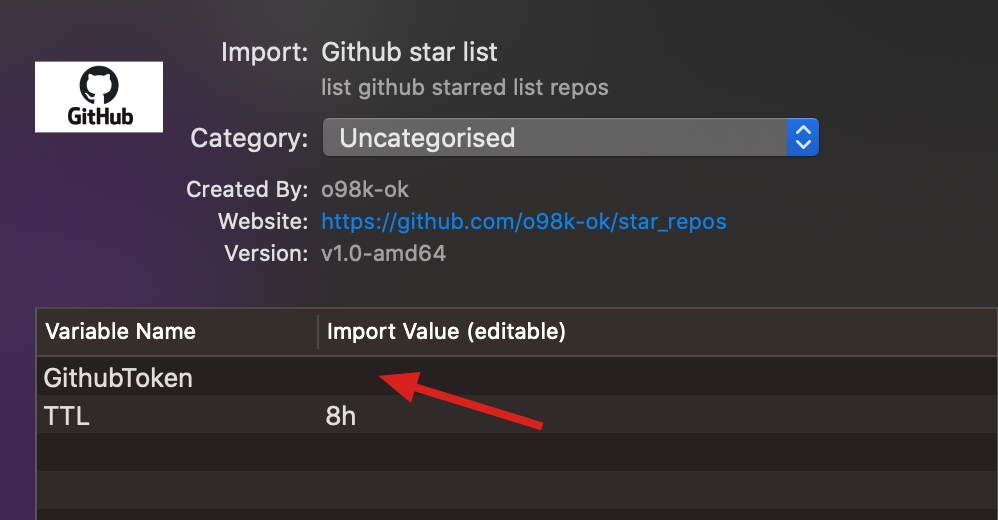
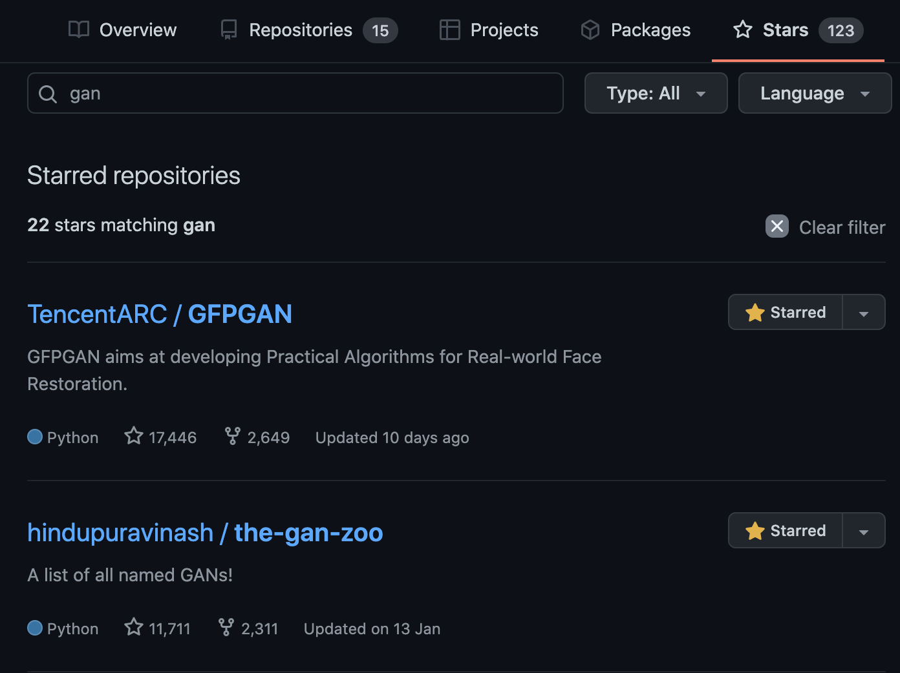
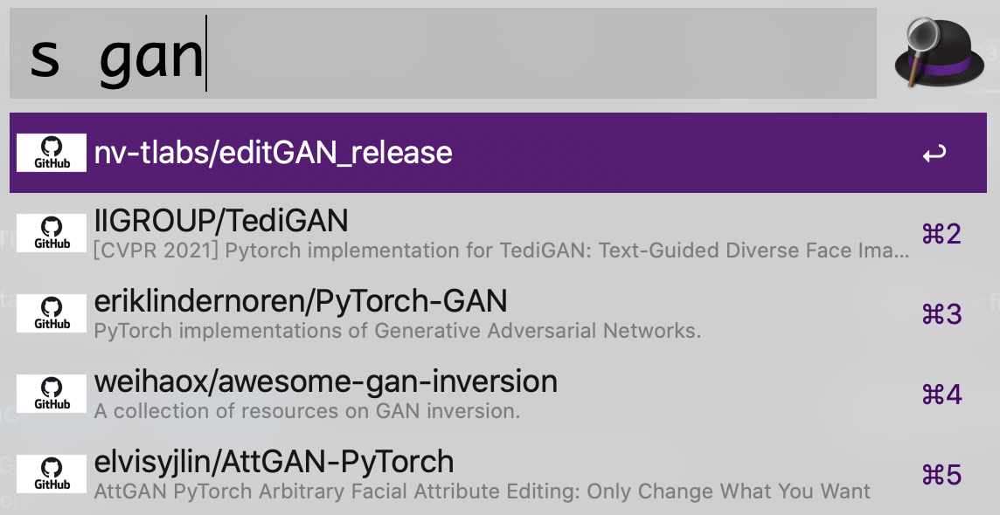

# Github Starred Repos Flow

Alfred workflow for personal github starred repos.

## Install

1. Download [Releases · o98k-ok/github-starred-repos-flow · GitHub](https://github.com/o98k-ok/github-starred-repos-flow/releases) latest version.

2. [Gengerate Token](https://github.com/settings/tokens) via [authentication methods - GitHub Docs](https://docs.github.com/en/rest/overview/other-authentication-methods#basic-authentication)

3. Install and fill with token

## Introduce

You can search repos via `github stars select box`.

Also you can do in alfred now.

## Features

1. select repos by `owner/repo`.

2. `Enter`: open default browser with repo link.

3. `Command+Enter`: copy the repo link to clipboard.

## Acknowledgement

1. [php version](https://github.com/stroebjo/alfred-github-stars) for `Github Starred Repos Flow`
